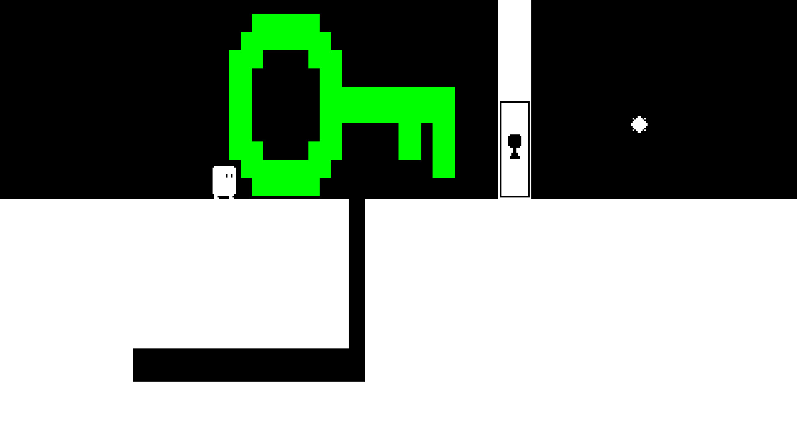

# Skala

Skala is a puzzle game written in C using a custom engine. The engine is built on Win32, Xlib, Opengl, and [miniaudio.h](https://miniaud.io/), and can be found in [lib/engine](./lib/engine/) and [include/engine](./include/engine).

Skala can be played for free on [Steam](https://store.steampowered.com/app/1884990/Skala/).

